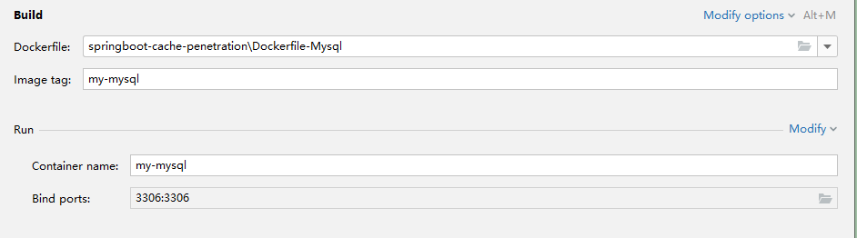
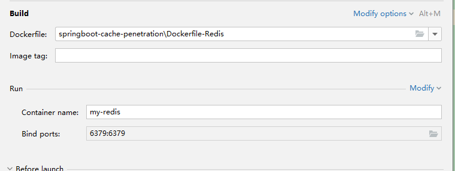
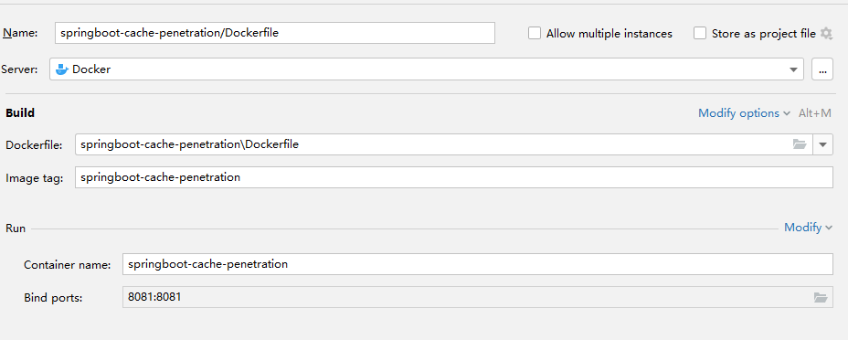
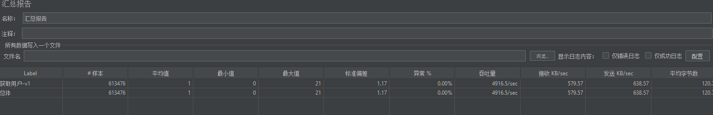
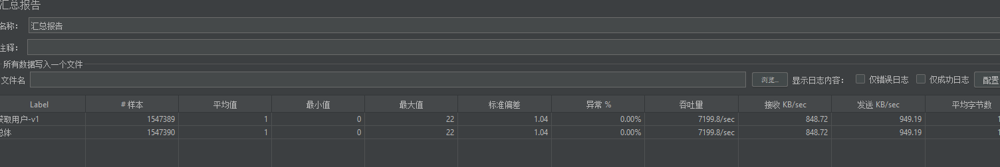

### 缓存穿透实验

### 实验环境
Centos7
JDK1.8
SpringBoot2.1.3
Docker version 25.0.2, build 29cf629
redis:latest
mysql:8.0

### 启动步骤
run Dockerfile-mysql

run Dockerfile-redis

run SpringBootCachePenetrationApplication

### 关键对比代码
getUser vs getUserV2

### jmeter
[缓存穿透.jmx](缓存穿透.jmx)

### 测试结果
getUser

getUserV2

### 总结
1. 缓存穿透是指查询一个一定不存在的数据，由于缓存是不命中时被动写的，并且出于容错考虑，如果从存储层查不到数据则不写入缓存，这将导致这个不存在的数据每次请求都要到存储层去查询，失去了缓存的意义。
2. 解决方案：缓存空对象。在缓存中存储空对象，比如空字符串、空对象等，这样下次再来查询这个数据时，就可以命中缓存了。
3. 缓存穿透是指缓存和数据库中都没有的数据，而用户不断发起请求，这时大量的请求都会穿透缓存，直接请求数据库，就像穿透了一样，对后端数据库造成很大压力。
4. 缓存穿透的解决方案：使用布隆过滤器，将所有可能存在的数据哈希到一个足够大的bitmap中，一个一定不存在的数据会被 这个bitmap拦截掉，从而避免了对底层存储系统的查询压力。
5. 缓存穿透的解决方案：使用互斥锁，当一个查询返回为空时，不是立刻去load db，而是先使用缓存工具的某些带成功操作返回值的操作（比如Redis的SETNX或者Memcache的ADD）去set一个mutex key，当操作返回成功时，再load db的数据并回设缓存；否则，就重试整个get缓存的方法。
6. 缓存穿透的解决方案：使用限流，对一定不存在的数据进行限流，比如对一秒内的相同请求只允许一次查询，其余的直接拒绝，这样可以保护后端系统。
7. 缓存穿透的解决方案：使用缓存预热，将所有可能存在的数据提前加载到缓存中，这样就不会因为一些数据没有被查询过就不会被缓存而导致缓存穿透。
8. 缓存穿透的解决方案：使用降级，当缓存失效后，通过降级策略（如读取DB）来避免缓存穿透。
9. 缓存穿透的解决方案：使用缓存击穿，对热点数据永远不过期，或者设置热点数据永远不过期，这样就不会因为缓存失效而导致缓存穿透。
10. 缓存穿透的解决方案：使用一致性哈希，将所有可能存在的数据按照一定的规则分布到一个足够大的hash空间中，一个一定不存在的数据会被这个hash空间拦截掉，从而避免了对底层存储系统的查询压力。
11. 缓存穿透的解决方案：使用缓存雪崩，对缓存的失效时间进行随机分布，避免同一时间大量数据失效，从而避免了对底层存储系统的查询压力。
12. 缓存穿透的解决方案：使用缓存预取，提前加载缓存，避免缓存失效时大量请求直接访问数据库。
13. 缓存穿透的解决方案：使用缓存更新策略，当缓存失效时，通过更新策略（如异步更新）来避免缓存穿透。
